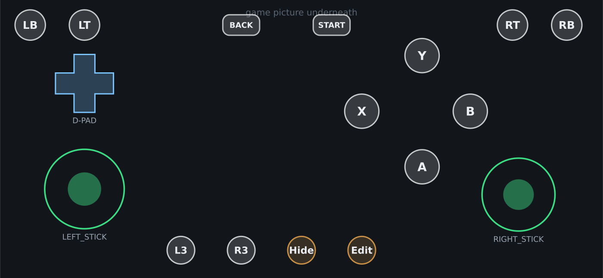

# Marathon Droid — Android launcher

An Android launcher for [Marathon Recompiled](../README.md), inspired by
[RimDroid](https://github.com/udarmolota/RimDroid).

Marathon Recompiled is a native **x86_64 Linux** program. Phones are ARM64, so the
launcher runs it through a translation layer — and you choose which one from a dropdown
on the home screen:

| Backend | How it ships | Notes |
|---|---|---|
| **Box64** | **Built into the APK** — nothing to install | Officially supports Android. Compiled from the pinned `android/box64` submodule as part of the app build. |
| **FEX‑Emu** | Optional, imported by you | Can be faster, but **upstream FEX does not support Android and says it never will** — see [below](#why-fex-is-not-bundled). |

Box64 is the default and works the moment the app is installed.

> **No game data is included or distributed.** You supply your own legally acquired copy,
> exactly as with the desktop builds.

> **Just built the Linux binary and not sure what comes next?**
> See **[GETTING_STARTED.md](GETTING_STARTED.md)** — the binary alone will not run, it needs
> the converted game data beside it, and that conversion is a one-time step on a PC.

---



## Features

- **Box64 built in** — compiled into the APK, no runtime download, no Termux.
- **Install the game from a .zip** — unpacked by the launcher, no manual file shuffling.
- **Turnip support** — import Mesa's Adreno Vulkan driver and the launcher wires it in.
- **Backend choice** — Box64 or an imported FEX‑Emu, switchable at any time.
- **On-screen Xbox 360 pad** — two analog sticks, d-pad with diagonals, A/B/X/Y,
  LB/RB/LT/RT, Start/Back and L3/R3.
- **Layout editor** — drag to move, sliders for size and opacity, rebind any button,
  add or delete controls, reset to default.
- **Automatic gamepad handover** — plug in a controller and the touch overlay disappears
  completely; unplug it and the overlay comes back.
- **Rumble** — the game's vibration requests drive the phone's motor.
- **English and Russian** UI.

---

## How input reaches the game

The game runs as a **separate process** inside the emulator, so Android's input events
cannot reach it directly — and inside box64/FEX there are no Android input devices to
speak of.

Instead both sides share a small memory-mapped file:

```
 touch overlay ─┐
                ├─→ PadState ─→ JNI ─→ [ shared memory ] ─→ hid::vpad ─→ XamInputGetState
 gamepad       ─┘   (merge)                 seqlock                        (the game)
                                                 ↑
                                          rumble travels back
```

- The launcher is the only writer, the game is the only reader; a seqlock means the game
  never observes a half-written frame (verified with a 2 000 000-frame concurrency test).
- Values are raw XInput: buttons are `XAMINPUT_GAMEPAD_*` masks, triggers `0..255`,
  sticks `-32768..32767`. No translation table exists anywhere, because none is needed.
- The ABI lives in [`MarathonRecomp/hid/virtual_pad_shm.h`](../MarathonRecomp/hid/virtual_pad_shm.h)
  and is included by both the game and the launcher's JNI code, so the two cannot drift apart.

On the game side this is completely inert unless `MARATHON_RECOMP_VPAD` points at the
file, so desktop builds behave exactly as before.

### Why a physical pad wins

`hid::GetState` only consults the virtual pad when **no SDL controller is open**. So when
you plug a controller into the phone, the game reads that controller directly and the
launcher hides the overlay — there is no path where both fight over the same slot.

---

## How the backends are delivered

This is the part Android makes awkward, so it is worth stating plainly.

### The W^X rule

Since **Android 10** an app may not `exec()` anything from its own writable storage
(`filesDir`, `cacheDir`, external storage — all mounted no-exec). The only place an app
can execute a binary from is the **APK's native library directory**, which the package
installer extracts read-only with the execute bit set.

The installer, however, only extracts files matching **`lib*.so`**. So the trick — the same
one Termux and every launcher of this kind uses — is to *name the executable like a
library*:

```
box64 (an ordinary ARM64 PIE executable)  ->  packaged as libbox64.so
```

It is not converted to a shared library; only the file name changes. At runtime the
launcher executes
`getApplicationInfo().nativeLibraryDir + "/libbox64.so"`.

Two things make this work, and both are already set:

- `android:extractNativeLibs="true"` in the manifest, and `useLegacyPackaging = true` for
  jniLibs in `app/build.gradle.kts` — without them the library stays compressed inside the
  APK and there is no real file to execute.
- The CMake rename in `app/src/main/cpp/CMakeLists.txt`
  (`PREFIX "lib"`, `SUFFIX ".so"`).

### Box64 — built in

`android/box64` is a submodule pinned to release **v0.4.3-4**, built by the app's own
CMake with `-DANDROID=ON -DARM64=ON`. box64 supports Android upstream, so this is just a
normal cross-compile; the result is packaged as `libbox64.so` and the user never sees a
setup step.

To build without it (much faster iteration on the UI):

```bash
./gradlew assembleDebug -PbundleBox64=false      # see the flag in app/build.gradle.kts
```

### Why FEX is not bundled

FEX-Emu **cannot be bundled the same way today**, and this is not a matter of effort:

- Its build system has **no Android target at all** — `grep -i android` across FEX's
  CMake comes back empty, and there is no NDK toolchain path.
- The upstream [FAQ](https://wiki.fex-emu.com/index.php/FAQ) is explicit:
  *"FEX-Emu's target is Linux on Linux devices. Android is not a target and will never be
  a target."* It expects glibc, SysV IPC and syscalls that Android removes or blocks
  through SECCOMP.
- Working Android FEX builds exist only as **unofficial ports**
  (e.g. [Fex-Android](https://github.com/AllPlatform/Fex-Android),
  [FEXDroid](https://github.com/gamextra4u/FEXDroid)), and those run inside Termux + proot
  rather than as a plain APK.

Shipping a broken FEX would be worse than not shipping one, so the launcher keeps FEX as
an **optional, user-supplied runtime**:

*Choose FEX-Emu → **Import runtime package (.zip)***

```
FEXInterpreter
rootfs/
  lib/x86_64-linux-gnu/...
  usr/lib/x86_64-linux-gnu/...
```

It is unpacked to `filesDir/runtime/fex/`, and the importer rejects entries that try to
escape that directory.

**Be aware of the consequence of the W^X rule above:** a FEX binary unpacked into
`filesDir` cannot be executed on Android 10+. The launcher detects this and says so
directly instead of failing with a bare "permission denied". FEX is therefore realistically
usable only if you are on an older device, or if you supply a build that the app can load
rather than exec. If you want FEX properly bundled, the honest route is to port it to the
NDK and build it into the APK exactly like box64 — the launcher's backend abstraction is
already in place for that, and only `Emulator.FEX.bundled` would need to flip to `true`.

---

## Setup

### 1. Backend

Box64 needs no setup. Only pick *Import runtime package* if you deliberately want FEX and
have read the section above.

### 2. Install the game

Two ways, whichever suits you:

- **Install the game from a .zip** (recommended) — pick a zipped Linux build and the
  launcher unpacks it into its own storage. It copes with the usual archive shapes: the
  executable at the top level, or wrapped in a single folder (which is flattened so the
  game data stays beside the binary). Entries that try to escape the target directory are
  rejected.
- **Select the game folder** — for a build you already unpacked yourself.

An installed copy always takes priority over a picked folder, and *Remove the installed
game* deletes it again (saves are kept).

> **Why the app's own storage is allowed here.** Android's no-exec rule applies to
> `exec()`, and box64 never `exec()`s the game: it opens it with `fopen(..., "rb")` and
> maps the segments itself (`box64/src/core.c`). So the game binary needs no execute
> permission and no special location — only box64 does, and it lives in the APK.

### 2b. Graphics: Turnip (optional but recommended)

Marathon Recompiled renders with **Vulkan**. Under emulation the system Vulkan driver is
often the weak point, so the launcher can use **Turnip** — Mesa's open-source Vulkan
driver for Adreno — instead:

*Graphics → **Import a Vulkan driver (Turnip)*** — accepts a bare `.so` or an
AdrenoTools-style `.zip`.

The driver is wired in the standard way: the launcher writes a Vulkan **ICD manifest** and
points `VK_ICD_FILENAMES` / `VK_DRIVER_FILES` at it. No linker hooks are needed, because
the game runs as its own process rather than inside the app.

- **Turnip is Adreno-only.** The launcher probes the GPU and, on a Mali/Xclipse/PowerVR
  device, says so instead of letting the driver fail later.
- Untick *Use the imported Vulkan driver* to fall back to the system one at any time.
- There is deliberately **no Zink** here: Zink translates OpenGL to Vulkan, and this game
  is already Vulkan-native, so it would only add a pointless layer.

### 3. Play

The **Play** button stays disabled until both the runtime and the game folder are valid.

---

## The layout editor

Reachable from the home screen, from the in-game quick menu, or from the small **Edit**
button on the overlay itself.

| Action | How |
|---|---|
| Move a control | Drag it |
| Resize | *Size* slider (50 %–250 %) |
| Opacity | *Opacity* slider |
| Rebind | *Binding* → pick any Xbox 360 input |
| Round / rectangular | *Round* checkbox |
| Hold vs latch | *Latch* checkbox |
| Add | *Add* → button, stick or d-pad |
| Delete | Select, then *Delete* |
| Start over | *Reset* |

Positions are stored as **fractions of the screen**, so a layout arranged on a phone still
lands correctly on a tablet and survives rotation. Leaving without saving asks first.

The stock layout is not eyeballed — it was checked with circle-accurate collision tests at
720p/1.5×, 1080p/2.0×, 2340×1080/2.75×, 2400×1080/3.0×, 2560×1600/2.0× and 4K/3.5×, and
nothing overlaps or falls off screen on any of them.

---

## Building

```bash
cd android
./gradlew assembleDebug      # app/build/outputs/apk/debug/marathondroid-debug.apk
```

Requirements: JDK 17, Android SDK 35, NDK r27, CMake 3.22. CI does all of this in
[`.github/workflows/build-android.yml`](../.github/workflows/build-android.yml) — it needs
no secrets, because the launcher never touches game data.

The launcher must be built from inside the MarathonRecomp checkout: its `CMakeLists.txt`
includes the pad ABI header from `MarathonRecomp/hid/` and fails with a clear message
otherwise.

---

## Status and honest expectations

The launcher, the input pipeline and the editor are complete and tested. What cannot be
verified without a physical device and a runtime package is the **end-to-end launch**:
how well the recompiled game performs under box64 or FEX on any given phone, and which
GPU driver each device needs.

Sonic '06 is a demanding 3D game and emulation adds cost on top. Treat performance on
anything but a recent flagship as unknown, and expect to try both backends.
